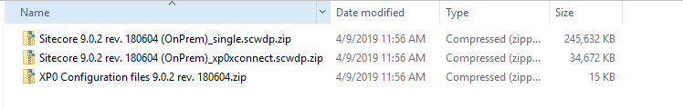
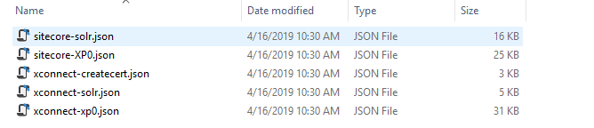
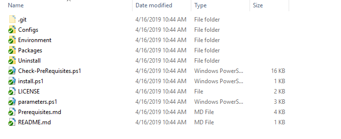
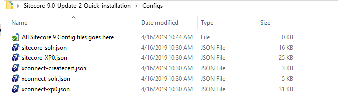
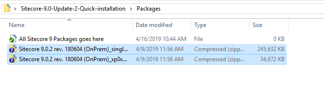
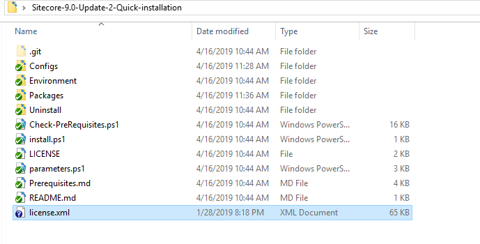

# Sitecore 9.0 Update 2 Auto Install
This is a simple Powershell script to install Sitecore 9 Update 2 for standlone/Developer instance. Follow the below steps to install the Sitecore in your local machine.

## Platform Support
- Windows OS (10 or Windows Server 2012 R2 (64 bit) or higher)
## Prerequisites
- Download the Sitecore 9.0 update 2 (*rev. 180604*) from [Sitecore Download Portal](https://dev.sitecore.net/Downloads/Sitecore_Experience_Platform/90/Sitecore_Experience_Platform_90_Update2.aspx)
- Unzip the Sitecore package and you will get another three zip files as pictured below

- Unzip the *XP0 Configuration files 9.0.2 rev. 180604.zip*. This will have the json files as pictured below

- After the above steps are completed clone or download this branch this to your local. You will get the folder structure as below

- Copy all the extractued config files from *XP0 Configuration files 9.0.2 rev. 180604* and paste it into the *Configs* folder

- Copy the *Sitecore 9.0.2 rev. 180604 (OnPrem)_single.scwdp.zip* and *Sitecore 9.0.2 rev. 180604 (OnPrem)_xp0xconnect.scwdp.zip* and paste it into Packages folder

- Copy the Sitecore *license.xml* to main folder


## Steps to Install
- Make sure all the above steps have been completed and run Powershell in Admin mode
- Navigate to the folder in Powershell and run the below command to check your system is ready to install Sitecore 9.0 update 2
```powershell
.\Check-PreRequisites.ps1
```

- The above command will validate your machine has required packages for Sitecore 9 has already installed. If yes the test will pass else you will get error
- If the case is failed no need to worry we have written script to install all the dependencies which required for Sitecore 9 installation
- To install all the dependencies and Sitecore 9.0 update 2 run the below command in Powershell
```powershell
.\install.ps1
```
- This will download the Solr and enable it in https mode. Also it will register and install the Sitecore SIF
- Sitecore 9.0 Update 2 has installed. Happy Sitecoring!!!

## Maintainers
- [Gowtham Eswaramoorthy](https://github.com/GowthamEswaramoorthy)
- [Prabhu Ranganathan](https://github.com/prabhu-ranganathan)

## License
This Project is [licensed under the MIT License](https://github.com/GowthamEswaramoorthy/Sitecore-9.0-Update-2-Quick-installation/blob/master/LICENSE).